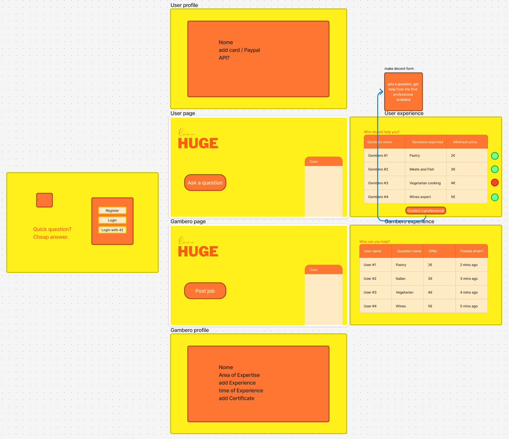

# Job Consultation App



*This mockup represents the original concept I had in mind when starting to create this webapp. The design showcases the core user flows including user profiles, job posting/viewing, and the professional marketplace experience. The application has evolved from this initial concept while maintaining the fundamental user experience patterns visualized here.*

A platform for connecting buyers with sellers for professional job consultations.

## Features

- User authentication with email/password and 42 OAuth
- User profiles with expertise and bio
- Market for job requests
- Messaging system between users
- Job assignment and completion tracking

## Tech Stack

- **Frontend**: Angular 17, Ionic Framework, Capacitor
- **Backend**: Express.js, MongoDB
- **Authentication**: JWT

## Project Setup

### Prerequisites

- Node.js (v16 or higher)
- MongoDB (v4.0 or higher)
- Angular CLI
- Android Studio (for mobile deployment)
- ADB (Android Debug Bridge)

### Installation

1. Clone the repository
```bash
git clone <repository-url>
cd job-consultation-app
```

2. Install dependencies
```bash
npm install
```

3. Configure environment
- Create a `.env` file in the backend directory with the following variables:
```
NODE_ENV=development
PORT=3000
MONGO_URI=mongodb://localhost:27017/job-consultation
JWT_SECRET=your_randomly_generated_secret_key  # Important for security! Generate with: node -e "console.log(require('crypto').randomBytes(64).toString('hex'))"
FORTYTWO_CLIENT_ID=your_42_client_id
FORTYTWO_CLIENT_SECRET=your_42_client_secret
FORTYTWO_CALLBACK_URL=http://localhost:4200/oauth-callback
```

> **SECURITY NOTE:** Never commit your actual JWT_SECRET to version control. Always generate a unique secret for each deployment using the command above.

## Running the App on PC

1. Start the MongoDB server (see MongoDB section below for WSL users)

2. Start the backend server
```bash
cd job-consultation-app/backend
node server.js
```

3. Start the frontend development server (in a separate terminal)
```bash
cd job-consultation-app
npm start
```

4. Access the application in your browser
```
http://localhost:4200
```

## Running the App on Android Device

### Development Setup (Live Reload)

1. Start the backend server
```bash
cd job-consultation-app/backend
node server.js
```

2. Set up ADB reverse port forwarding (in a separate terminal)
```powershell
# Navigate to ADB (if not in PATH)
cd C:\Users\<YOUR_USERNAME>\AppData\Local\Android\Sdk\platform-tools

# Set up port forwarding
adb reverse tcp:3000 tcp:3000
adb reverse tcp:4200 tcp:4200

# Verify the device is connected
adb devices
```

3. Make sure your `src/environments/environment.ts` is set to use localhost with ADB reverse:
```typescript
export const environment = {
  production: false,
  apiUrl: 'http://localhost:3000/api',
  // ...other settings
};
```

4. Build the Angular app and sync with Capacitor
```bash
cd job-consultation-app
npm run build
npx cap sync android
```

5. Open and run in Android Studio
```bash
npx cap open android
```
Then in Android Studio:
- Connect your device
- Enable USB debugging on your device
- Select your device in the device dropdown
- Click the Run button (green triangle)

### Production Build for Android

1. Update environment.prod.ts with appropriate API URL

2. Build the app for production
```bash
npm run build -- --configuration=production
npx cap sync android
```

3. Open in Android Studio
```bash
npx cap open android
```

4. Generate a signed APK/AAB in Android Studio:
   - Build > Generate Signed Bundle/APK

## Troubleshooting Common Issues

### API Connection Issues
- Verify backend is running correctly: `curl http://localhost:3000/api/test`
- Ensure ADB reverse commands completed successfully
- Check your device has internet permissions enabled
- Inspect the network_security_config.xml to ensure proper domains are allowed

### Build Issues
- Always run `npm run build` followed by `npx cap sync android` after making changes
- Clear cache if necessary: `npm cache clean --force`

### ADB Connection Issues
- Try unplugging and reconnecting your device
- Restart ADB: `adb kill-server` followed by `adb start-server`
- Ensure USB debugging is enabled on the device

### 42 OAuth Issues
- Make sure your redirect URLs are correctly set in the 42 API settings
- Check that environment variables match your 42 API application settings

## MongoDB on WSL (Developer Note)

When running MongoDB on Windows Subsystem for Linux (WSL), you'll need to manage MongoDB manually:

```bash
# Starting MongoDB manually (after system restart)
mkdir -p ~/data/db  # Only needed first time
mongod --dbpath ~/data/db --fork --logpath ~/mongodb.log

# Stopping MongoDB properly
mongosh admin --eval "db.shutdownServer()"

# Checking MongoDB status
ps aux | grep mongod

# Connecting to MongoDB shell
mongosh
```

These commands are necessary because WSL doesn't use systemd by default, so standard service management commands won't work.

## Project Structure

- `/src`: Angular application
  - `/app`: Core application code
    - `/components`: Reusable UI components
    - `/pages`: Application pages
    - `/services`: Business logic and API calls
    - `/guards`: Route guards
    - `/models`: Data models/interfaces
  - `/assets`: Static assets
  - `/environments`: Environment configurations

- `/backend`: Express.js backend
  - `/middleware`: Custom middleware
  - `/models`: MongoDB models
  - `/routes`: API routes
  - `server.js`: Main server file

## API Endpoints

### Authentication
- `POST /api/auth/register`: Register a new user
- `POST /api/auth/login`: Login with email/password
- `POST /api/auth/42`: Login with 42 OAuth
- `GET /api/auth/user`: Get authenticated user data

### Users
- `GET /api/users/profile`: Get current user's profile
- `POST /api/users/profile`: Create or update user profile
- `GET /api/users/profile/:userId`: Get profile by user ID
- `GET /api/users/sellers`: Get all sellers' profiles

### Jobs
- `POST /api/jobs`: Create a new job request
- `GET /api/jobs`: Get all jobs relevant to the user
- `GET /api/jobs/:id`: Get job by ID
- `PUT /api/jobs/:id/assign`: Assign a job to a seller
- `PUT /api/jobs/:id/complete`: Mark a job as completed

### Messages
- `POST /api/messages`: Send a message
- `GET /api/messages`: Get all messages for a user (conversations)
- `GET /api/messages/:userId`: Get messages between current user and another user
- `PUT /api/messages/read/:userId`: Mark messages from a user as read
- `GET /api/messages/unread/count`: Get count of unread messages
